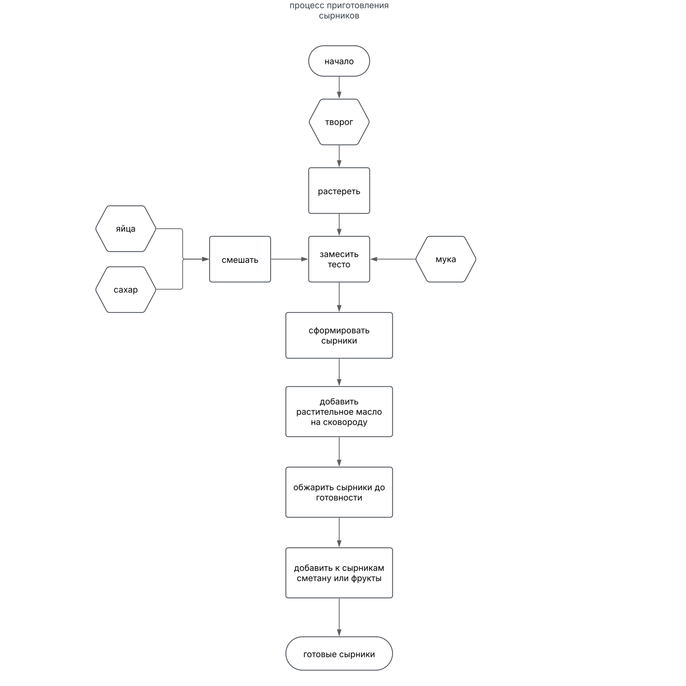

# Процесс приготовления сырников
## Необходимые ингредиенты:
	Творог 5% 350гр  
    Яйцо 1 шт.  
    Сахар 3 ст. ложки  
    Мука 3 ст. ложки  
    Растительное масло
    Сметана/фрукты/ягоды по желанию
## Шаги:
Разотрите творог.

Смешайте яйцо и сахар.

Соедините эту смесь с творогом. Добиться однородной массы можно при помощи блендера.

Добавьте по очереди три ложки муки, тщательно замешайте тесто.

Сформируйте сырники нужного вам размера.

Поставьте сковороду на средний огонь, добавьте растительное масло, затем выложите на сковороду сырники. Обжарьте их на среднем огне с каждой стороны по три минуты, затем убавьте огонь на минимум, закройте крышкой и готовьте их еще 7 – 10 минут.

Чтобы сделать ваш завтрак еще вкуснее, добавьте к сырникам сметану, фрукты или ягоды.

